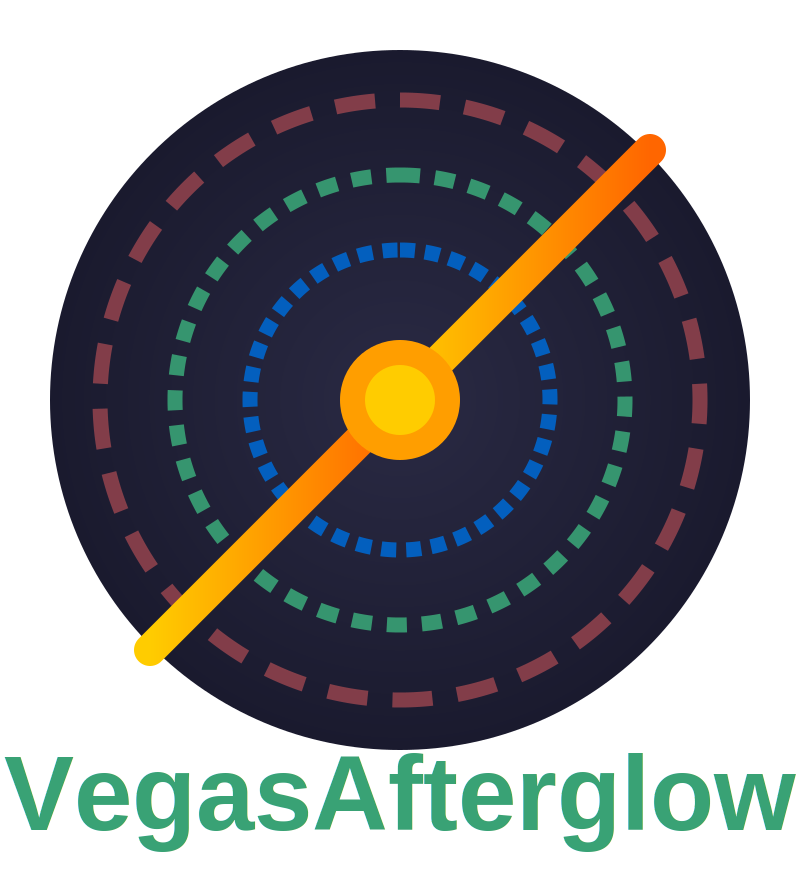

Welcome to VegasAfterglow
=======================

VegasAfterglow is a high-performance C++ framework for modeling gamma-ray burst afterglows with Python bindings.

Overview
--------

VegasAfterglow provides a state-of-the-art computational framework for simulating the multi-wavelength 
emission from gamma-ray burst (GRB) afterglows. It combines the performance benefits of C++ with the 
ease of use of Python, making it suitable for both rapid analysis and detailed modeling of complex 
relativistic outflows and their interaction with the surrounding medium.

Key Features
-----------

* **Multiple Jet Models**: Support for top-hat, Gaussian, and power-law structured jets
* **Diverse Ambient Media**: Models for uniform ISM and stellar wind environments
* **Advanced Radiation Processes**: Synchrotron emission and synchrotron self-Compton
* **Shock Dynamics**: Forward and reverse shock physics with relativistic hydrodynamics
* **High Performance**: Optimized C++ core for fast computations of afterglow emission
* **Python Integration**: Intuitive Python API for easy model setup and analysis
* **Modular Design**: Customizable components for jets, ambient media, and radiation processes
* **Flexible I/O**: Support for various data formats and visualization tools
* **Parameter Fitting**: Tools for comparing models with observational data using MCMC methods
* **Cross-platform**: Works on Linux, macOS, and Windows

.. toctree::
   :maxdepth: 2
   :caption: Contents:
   
   installation
   quickstart
   python_api
   cpp_api
   examples
   test_class
   documentation_guide
   contributing
   api/modules

Indices and tables
==================

* :ref:`genindex`